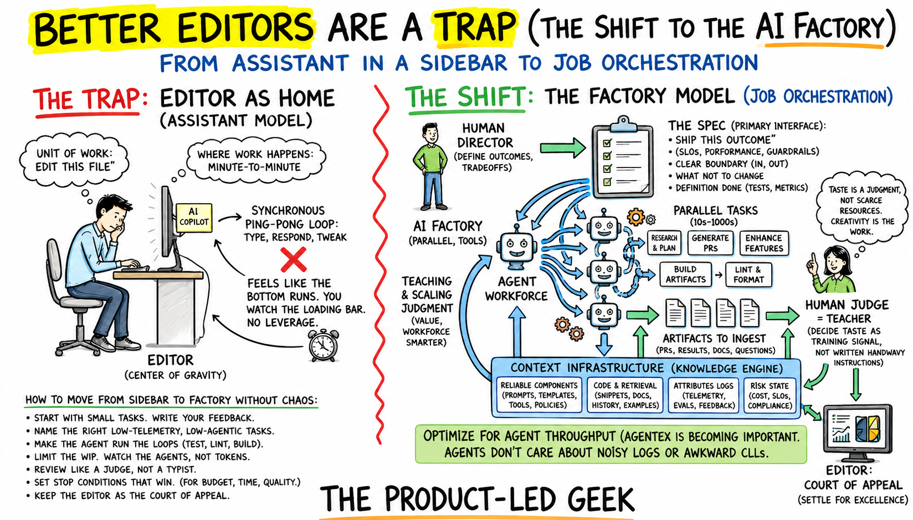

# itsjavi/skills

Reusable `SKILL.md`-based coding-agent skills and small CLI tools for Codex, Claude Code, Cursor, and compatible agents.
The collection focuses on docs-first planning workflows, implementation handoffs, and agent-friendly project memory.



> Inspired by [Better Editors are A Trap](https://www.plg.news/p/better-editors-are-a-trap)

## Why This Exists

These skills are for teams that want coding agents to work from durable project context instead of long chat histories.
They do not try to make the editor the source of truth. Instead, they help encode product memory, execution state, QA
expectations, and handoff structure into repo-owned docs that both humans and agents can inspect, update, and carry
forward.

That makes the workflow more explicit than a typical agent session. Plans, bug fixes, decisions, checks, manual QA
notes, and coordination state live beside the code, so a fresh agent can pick up a task with the same operating context
a human reviewer would expect. The tradeoff is intentional: a little more documentation discipline in exchange for less
hidden state, fewer context resets, and more repeatable implementation work.

This is not meant to be a full project-management system or an autonomous agent orchestrator. It is a practical set of
skills and templates for keeping AI-assisted development grounded in specs, checks, and reviewable project records. An
early experimental coordination prototype exists as `plan-coord`, but the recommended workflow is intentionally
docs-first: use `COORDINATION.md` for active work instead of relying on a local agent queue or database.

## Skills

| Skill                          | Use it for                                                                                                                                                                                                                  |
| ------------------------------ | --------------------------------------------------------------------------------------------------------------------------------------------------------------------------------------------------------------------------- |
| `setup-planning-workflow`      | Bootstrap or upgrade a docs-first planning workflow with product docs, milestones, bug fixes, business rules, decisions, plans, checkpoints, checks, manual QA, setup/security/env docs, templates, and agent instructions. |
| `create-milestone`             | Create or update milestones in an established workflow; chooses the next three-digit milestone id and keeps `MILESTONES.md` as an index.                                                                                    |
| `create-plan`                  | Create a milestone-scoped implementation plan in an established workflow, update the milestone record, and ask whether implementation should start.                                                                         |
| `create-implementation-prompt` | Draft a paste-ready fresh-agent prompt for implementing an existing milestone-scoped plan, including context, checks, manual QA, and circuit breakers.                                                                      |
| `generate-changelog`           | Generate or update root `CHANGELOG.md` from `.specs` changes using prepend-only dated blocks and product/spec language instead of commit-message summaries.                                                                 |
| `document-decision`            | Capture or supersede major durable architecture/product/security/operational decisions when they are decision-worthy.                                                                                                       |
| `create-design-guidelines`     | Create or update a project `DESIGN.md` / design-system guide for web or mobile UI work.                                                                                                                                     |
| `find-docs`                    | Retrieve current documentation, API references, and examples for libraries, frameworks, SDKs, CLIs, and cloud services with Context7.                                                                                       |
| `generate-commit-msg`          | Generate a Conventional Commit message from the current staged changes and output only the plaintext code message.                                                                                                          |

Each skill lives in `skills/<skill-name>/SKILL.md`. The registry is generated from skill frontmatter.

## Tools

| Tool              | Purpose                                                                                                                                                                   |
| ----------------- | ------------------------------------------------------------------------------------------------------------------------------------------------------------------------- |
| `create-worktree` | Create a Git worktree under `../<repo>-worktrees/`, copy `.env` when present, install dependencies from the detected lockfile, and optionally launch an agent in Ghostty. |

Experimental/manual-only tools:

- `plan-coord`: local SQLite coordination prototype. The planning workflow no longer recommends it for agents; use
  `COORDINATION.md` as the coordination source of truth. It lives under `tools/experimental/` and is not installed by
  `pnpm tools:install`.

## Rules

| Rule                         | Applies | Purpose                                                                                                                  |
| ---------------------------- | ------- | ------------------------------------------------------------------------------------------------------------------------ |
| `rules/token-efficiency.mdc` | Always  | Enforces terse, code-centric replies: no filler, changed snippets over full files, and minimal explanation unless asked. |

Rules are reusable agent/editor rule files. They are separate from skills and tools. There is no rules installer yet, so
copy or reference them manually in agent environments that support them.

## Install

Install dependencies:

```bash
pnpm install
```

Install all skills. Skill directories are symlinked by default:

| Target            | Command                                                 | Destination        |
| ----------------- | ------------------------------------------------------- | ------------------ |
| Codex user        | `pnpm skills:install codex`                             | `~/.agents/skills` |
| Claude user       | `pnpm skills:install claude`                            | `~/.claude/skills` |
| Cursor user       | `pnpm skills:install cursor`                            | `~/.cursor/skills` |
| Codex repo-local  | `/path/to/skills/scripts/install-skills.sh repo-codex`  | `./.agents/skills` |
| Claude repo-local | `/path/to/skills/scripts/install-skills.sh repo-claude` | `./.claude/skills` |
| Cursor repo-local | `/path/to/skills/scripts/install-skills.sh repo-cursor` | `./.cursor/skills` |

Useful installer options:

```bash
pnpm skills:install codex create-plan
pnpm skills:install codex --dry-run
pnpm skills:install codex --no-symlink
pnpm skills:install --help
```

Install tools. Tools are symlinked into `/usr/local/bin` by default. Tool files ending in `.sh` are installed without
the suffix. Experimental tools under `tools/experimental/` are ignored by the installer:

```bash
pnpm tools:install
scripts/install-tools.sh --bin-dir "$HOME/.local/bin"
scripts/install-tools.sh --dry-run
scripts/install-tools.sh --no-symlink
```

## Maintenance

Run the narrowest check that matches the change:

| Command                  | Purpose                                                                                |
| ------------------------ | -------------------------------------------------------------------------------------- |
| `pnpm skills:validate`   | Validate skill folders, frontmatter, folder/name consistency, and registry entries.    |
| `pnpm generate-registry` | Regenerate `registry.json` after adding/removing skills or changing skill frontmatter. |
| `pnpm format`            | Format files with `oxfmt` and sort `package.json`.                                     |
| `pnpm typecheck`         | Type-check TypeScript maintenance scripts and tools.                                   |

Repository rules of thumb:

- Keep skill folder names and frontmatter `name` values identical.
- Keep skill descriptions accurate; they are selection metadata for agents.
- Regenerate `registry.json` after skill additions, removals, renames, or frontmatter description changes.
- Prefer improving `SKILL.md` and bundled resources over adding extra docs inside a skill folder.
- Preserve the git index; do not stage, unstage, commit, or reset unless explicitly asked.

## Structure

```txt
skills/
  <skill-name>/
    SKILL.md
    agents/          # optional UI metadata
    assets/          # optional output assets/templates
    references/      # optional reference docs
    scripts/         # optional helper scripts
tools/
  *.sh               # installed without .sh suffix
  experimental/      # manual-only prototypes; ignored by tools installer
  <tool-name>/
rules/
  *.mdc
scripts/
  install-skills.*
  install-tools.sh
  generate-registry.ts
  validate-skills.ts
```

## Author

Maintained by [@itsjavi](https://github.com/itsjavi).
