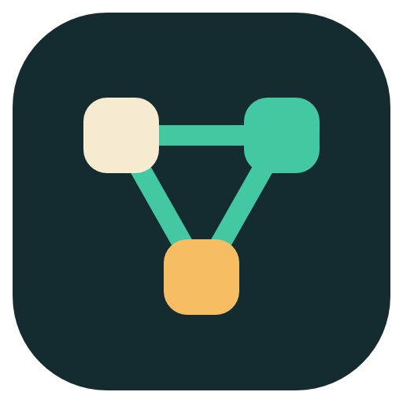
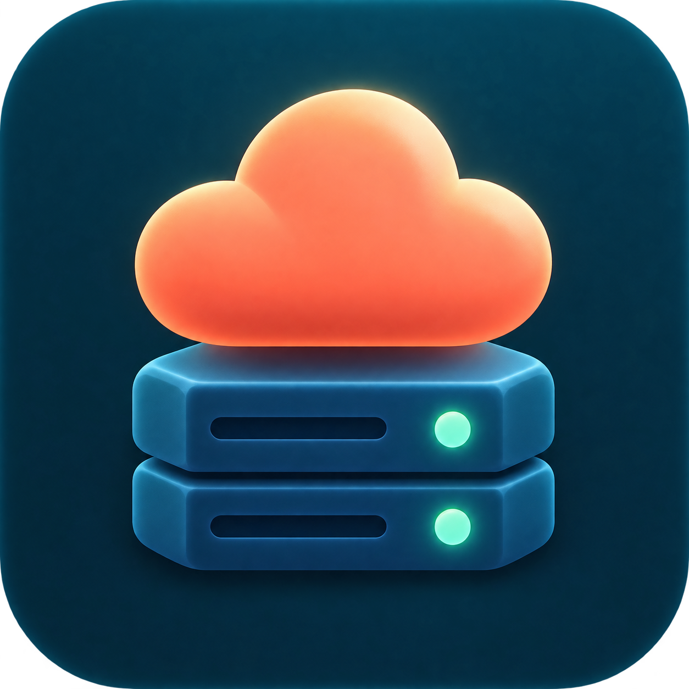
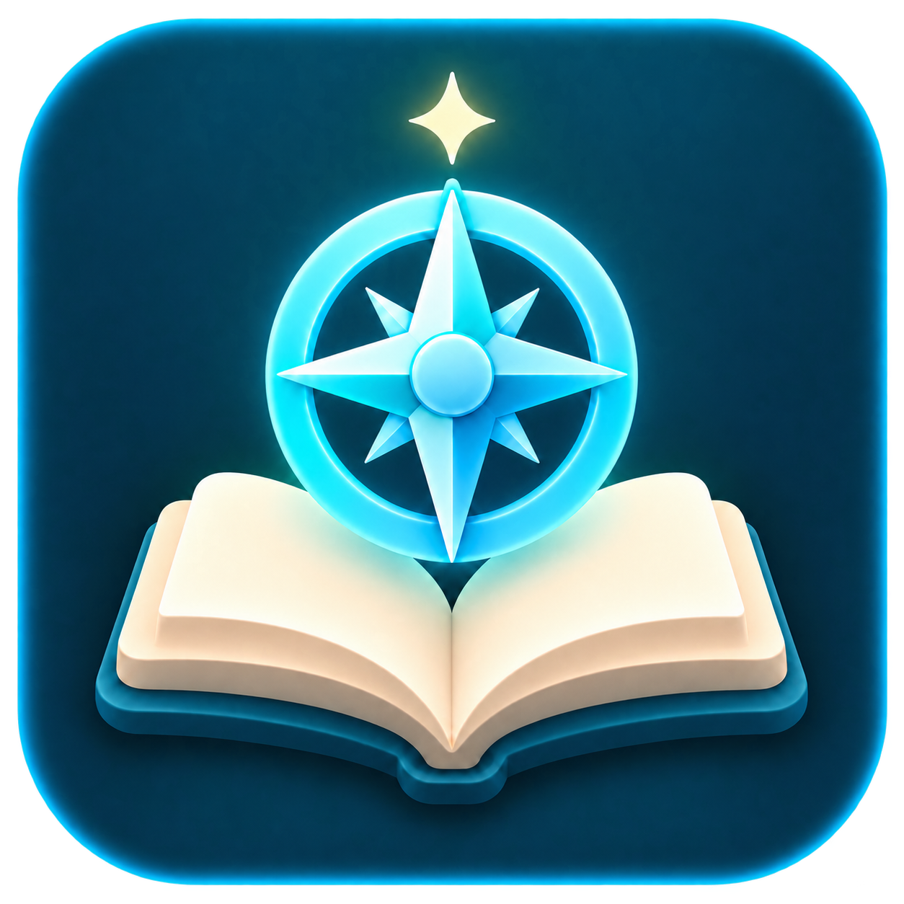
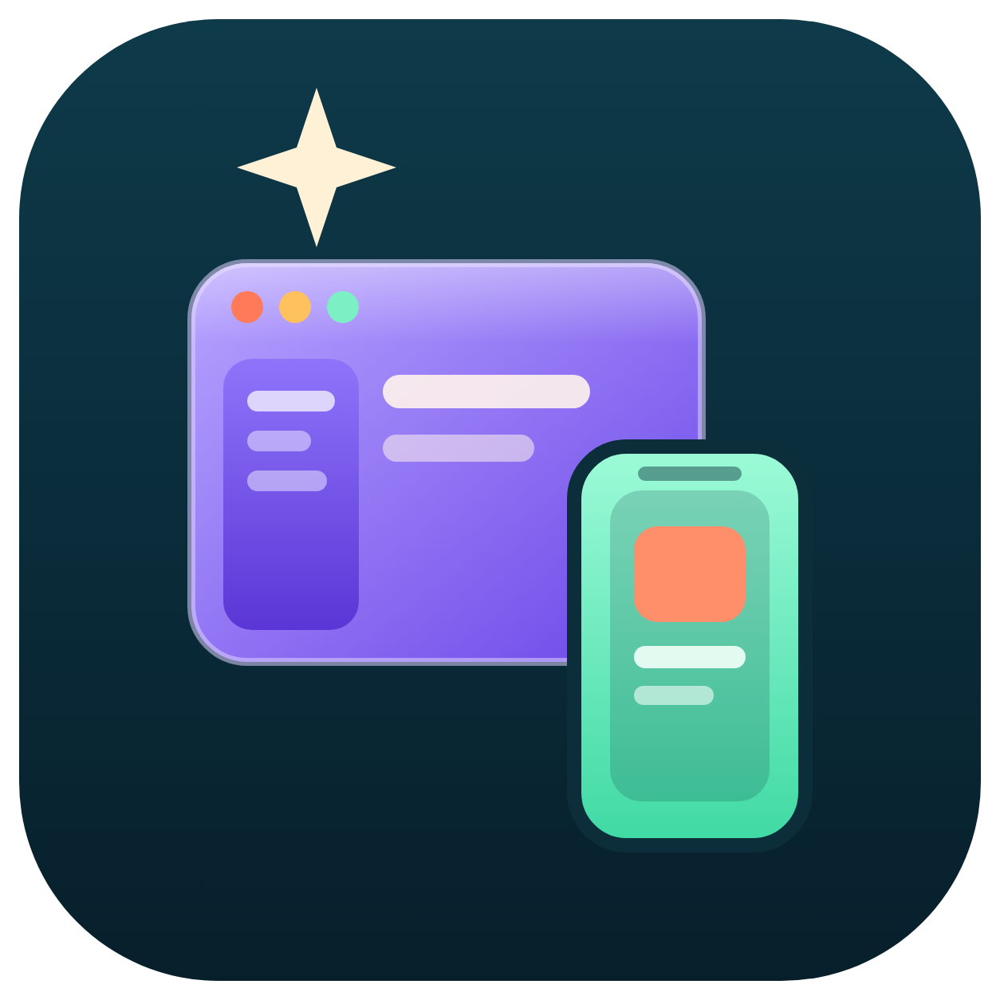
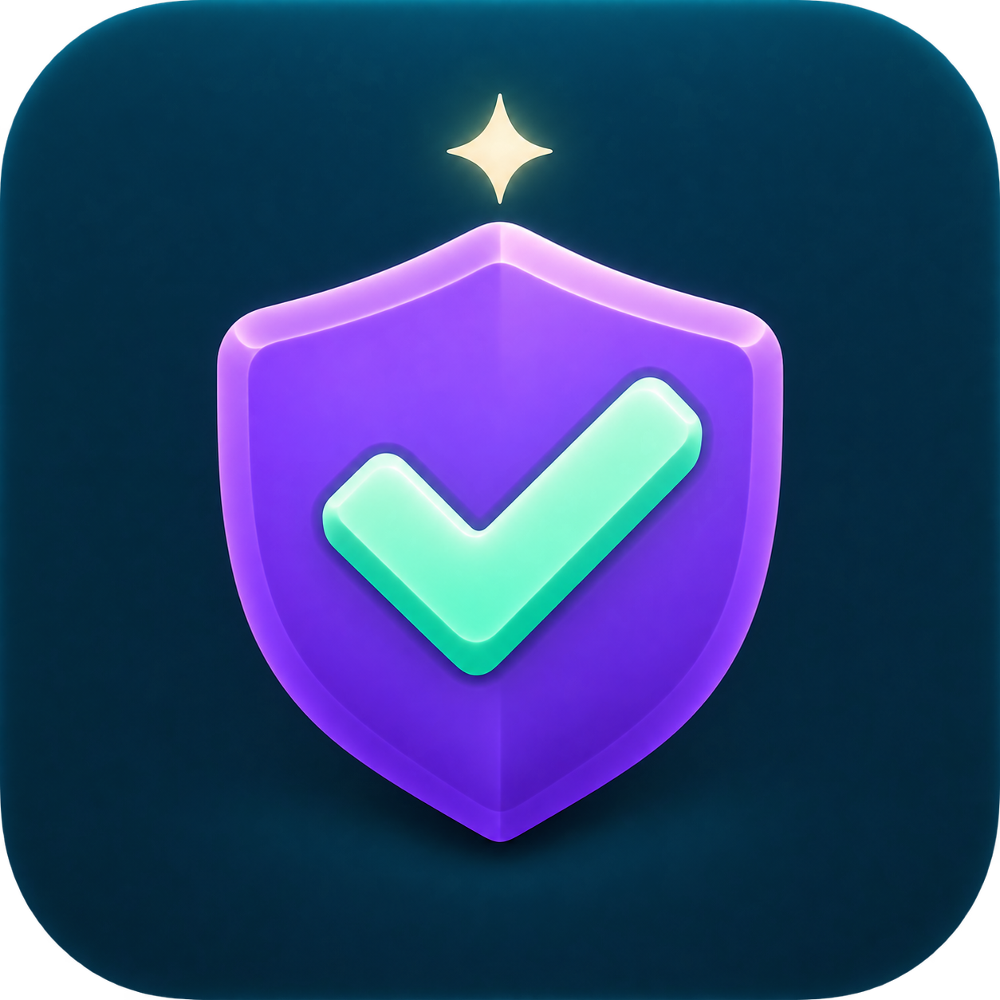
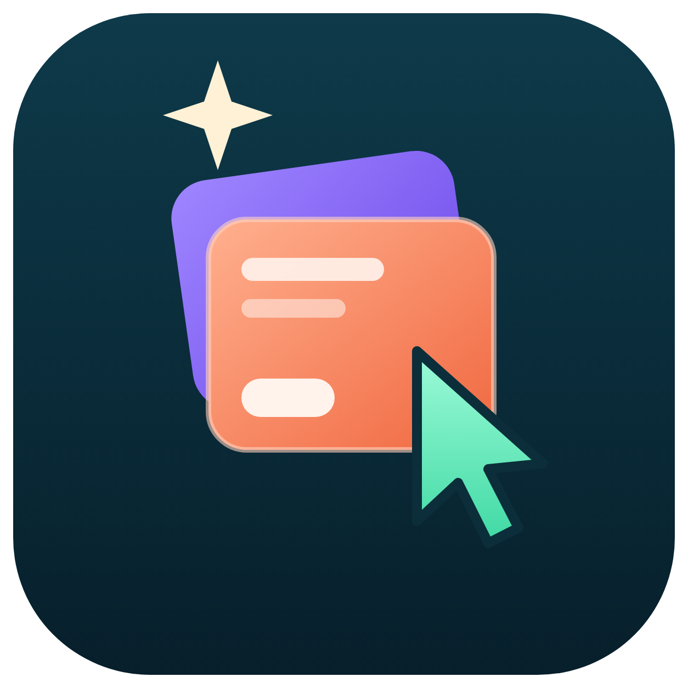
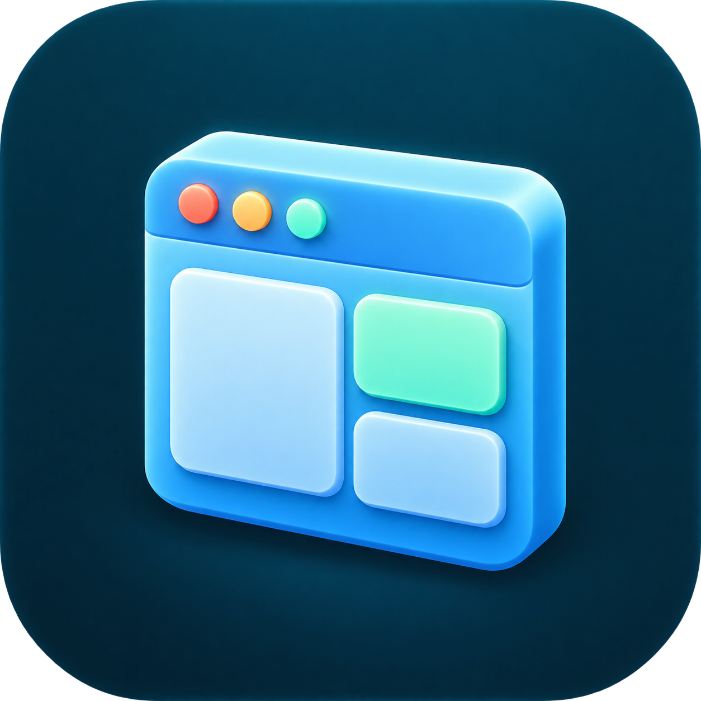

# itsjavi/skills

Reusable plugins for Codex, Claude Desktop and Claude Code, with shared skills maintained in this Git marketplace.

## Catalog

### Skills

<!-- catalog:skills:start -->

- [accessibility-review](plugins/uxdesign/skills/accessibility-review/SKILL.md): Run a WCAG 2.2 AA accessibility audit
  on a design, mockup, prototype or rendered page and report findings without changing code.
- [app-security-review](plugins/safeguard/skills/app-security-review/SKILL.md): Review repositories, features, or diffs
  for exploitable application security weaknesses, including injection, authentication and authorization failures,
  exposed APIs, and broken trust boundaries.
- [astra-develop](plugins/webcraft/skills/astra-develop/SKILL.md): End-to-end software development workflow that plans a
  task, resolves material ambiguity, implements it, and verifies acceptance criteria while routing bounded work to an
  appropriate model/reasoning level.
- [backlog-authoring](plugins/devscout/skills/backlog-authoring/SKILL.md): Author plans and native records for existing
  Backlog.md projects, using their configured MCP or CLI workflow.
- [blender-game-assets](plugins/gamegen/skills/blender-game-assets/SKILL.md): Build, texture, rig and export editable 3D
  game assets with local Blender CLI and bpy from references or a project brief.
- [changelog-authoring](plugins/devscout/skills/changelog-authoring/SKILL.md): Generate or update CHANGELOG.md and
  release notes from commit messages in a pull request or the current branch compared with its base, usually main, or
  from project specifications and planning records.
- [coolify-cli](plugins/coolify/skills/coolify-cli/SKILL.md): Operate Coolify instances through the official
  coollabsio/coolify-cli.
- [design-critique](plugins/uxdesign/skills/design-critique/SKILL.md): Get structured design feedback on usability,
  hierarchy, and consistency.
- [design-guide-authoring](plugins/webcraft/skills/design-guide-authoring/SKILL.md): Create or update a design guide or
  design system specification, usually DESIGN.md, for web or mobile interfaces.
- [design-handoff](plugins/uxdesign/skills/design-handoff/SKILL.md): Generate developer handoff specs from a design.
- [design-system](plugins/uxdesign/skills/design-system/SKILL.md): Audit, document, or extend an existing design system
  at the component level.
- [find-library-docs](plugins/devscout/skills/find-library-docs/SKILL.md): Find current documentation, API references,
  and code examples for libraries, frameworks, SDKs, CLI tools, and cloud services.
- [find-skills](plugins/devscout/skills/find-skills/SKILL.md): Discover and help install reusable agent skills.
- [fix-page-metadata](plugins/webcraft/skills/fix-page-metadata/SKILL.md): Audit and fix HTML metadata including page
  titles, meta descriptions, canonical URLs, Open Graph tags, Twitter cards, favicons, JSON-LD structured data, and
  robots directives.
- [fix-web-accessibility](plugins/webcraft/skills/fix-web-accessibility/SKILL.md): Audit and fix HTML accessibility
  issues including ARIA labels, keyboard navigation, focus management, color contrast, and form errors.
- [fix-web-rendering-performance](plugins/webcraft/skills/fix-web-rendering-performance/SKILL.md): Audit and fix web
  rendering performance, including animations, scrolling, layout thrashing, and expensive visual effects.
- [game-animation](plugins/gamegen/skills/game-animation/SKILL.md): For GameGen projects, author and verify skeletal,
  cutout or frame animations for game assets, including locomotion cadence, action timing, transitions and expressive
  motion.
- [game-audio-vfx](plugins/gamegen/skills/game-audio-vfx/SKILL.md): For GameGen projects, create and integrate game
  music, sound and visual feedback with coherent style, synchronized action timing, accessibility and runtime budgets.
- [game-bootstrap](plugins/gamegen/skills/game-bootstrap/SKILL.md): Set up a new game project or resolve missing GameGen
  preferences using question tools, then prove its selected asset-to-engine pipeline.
- [game-concept-art](plugins/gamegen/skills/game-concept-art/SKILL.md): Create or revise game concept art, the art
  direction document, consistent construction views, poses and visual targets from saved GameGen preferences before
  asset production.
- [game-export](plugins/gamegen/skills/game-export/SKILL.md): For GameGen projects, prepare and verify Godot exports for
  the configured platform and delivery stage, including reproducible local builds and signing when device or store
  delivery is requested.
- [game-optimization](plugins/gamegen/skills/game-optimization/SKILL.md): For GameGen projects, diagnose and improve
  game frame time, memory, loading and responsiveness using measured Godot workloads and saved platform budgets for 2D,
  2.5D or 3D.
- [game-production](plugins/gamegen/skills/game-production/SKILL.md): Coordinate an authorized game-production task from
  its saved GameGen brief through a playable slice, asset reviews and integration.
- [game-qa](plugins/gamegen/skills/game-qa/SKILL.md): For GameGen projects, verify game behavior and visual quality
  through isolated tests, actual Godot playthroughs and reference comparisons, with clear evidence and verification
  limits.
- [game-sprites](plugins/gamegen/skills/game-sprites/SKILL.md): For GameGen projects, produce and integrate pixel,
  painted, cutout or Blender-rendered game sprites with consistent identity, directions, pivots, alpha and atlas
  metadata.
- [game-tilesets](plugins/gamegen/skills/game-tilesets/SKILL.md): For GameGen projects, create and validate game
  tilesets, terrain transitions and tile metadata for square, isometric or hexagonal levels, including optional
  SpriteCook generation.
- [game-ui-input](plugins/gamegen/skills/game-ui-input/SKILL.md): Build or refine game interfaces and keyboard,
  controller or touch input from GameGen platform preferences, including accessible layouts and simultaneous mobile
  controls.
- [game-world-building](plugins/gamegen/skills/game-world-building/SKILL.md): For GameGen projects, assemble game levels
  and presentation in Godot, including cameras, lighting, materials, occlusion and the spatial rules of 2D, 3D and 2.5D
  worlds.
- [generate-commit-message](plugins/webcraft/skills/generate-commit-message/SKILL.md): Generate a Conventional Commit
  message from the repository's staged Git changes.
- [godot-gameplay](plugins/gamegen/skills/godot-gameplay/SKILL.md): Implement or extend Godot gameplay, actor
  interactions, progression and persistence using the saved GameGen concept, scope and 2D or 3D simulation settings.
- [macos-app-development](plugins/nativeapps/skills/macos-app-development/SKILL.md): Bootstrap and build modern native
  macOS apps in Swift (SwiftUI + AppKit, Swift 6, macOS 26+).
- [macos-app-icons](plugins/nativeapps/skills/macos-app-icons/SKILL.md): Design and build macOS app icons and in-app
  icon tiles procedurally, with no image generator.
- [react-development](plugins/webcraft/skills/react-development/SKILL.md): Build, debug, refactor, and review React web
  apps, components, and hooks.
- [react-router](plugins/webcraft/skills/react-router/SKILL.md): Build applications with React Router in Framework,
  Data, Declarative, and unstable RSC modes.
- [research-synthesis](plugins/uxdesign/skills/research-synthesis/SKILL.md): Synthesize user research into themes,
  insights, and recommendations.
- [setup-agent-workspace](plugins/agent-fleet/skills/setup-agent-workspace/SKILL.md): Set up or update portable Codex
  and Claude agent coordination in a Git project, with project-specific agents, execution policies, Backlog, versioned
  tooling, and standalone preview/apply commands.
- [trust-and-safety-review](plugins/safeguard/skills/trust-and-safety-review/SKILL.md): Review product designs and
  implementation for abuse through user-generated content and interactions, including phishing, scams, harassment, spam,
  and moderation failures.
- [ui-screenshots](plugins/webcraft/skills/ui-screenshots/SKILL.md): Capture screenshots and short clips of any web
  application's UI for visual review, documentation, or pull requests.
- [unattended-work](plugins/agent-fleet/skills/unattended-work/SKILL.md): Coordinate an authorized unattended project
  run using configured agents, task claims, review, validation, and commit policy.
- [user-research](plugins/uxdesign/skills/user-research/SKILL.md): Plan and run user research studies, including
  choosing methods and writing research plans, interview guides, usability test scripts, and surveys.
- [ux-copy](plugins/uxdesign/skills/ux-copy/SKILL.md): Write or review UX copy , microcopy, error messages, empty
  states, CTAs.
- [visual-evidence-review](plugins/agent-fleet/skills/visual-evidence-review/SKILL.md): Capture and inspect concise
  before/after evidence for significant UI or design changes, store up to three WebP comparisons in Backlog tasks, and
  document truthful text-only or visually unchanged exemptions.

<!-- catalog:skills:end -->

Install a plugin below to receive its bundled skills and versioned updates. Each skill lives at
`plugins/<plugin>/skills/<skill>/`. If you prefer a standalone skill, copy its whole directory into `~/.agents/skills`,
`~/.codex/skills` or `~/.claude/skills`, or the corresponding project directory. Some skills, especially GameGen skills,
also depend on files elsewhere in their plugin, so install those as a complete package. Manually copied skills need
manual updates. Remove any older standalone copies when switching to their plugin to avoid duplicate skills.

### Plugins

<!-- catalog:plugins:start -->

-  [Agent Fleet](plugins/agent-fleet): Set
  up and update portable agent workspaces, coordinate scoped unattended work, and review UI changes with visual
  evidence.
-  [Coolify](plugins/coolify): Operate Coolify
  through its official CLI for configuration, deployments, logs, services, databases and infrastructure management.
-  [DevScout](plugins/devscout): Discover
  agent skills and library documentation, maintain Backlog.md plans and write changelogs for development workflows.
-  [GameGen](plugins/gamegen): Create 2D, 2.5D
  and 3D games with shared project preferences, concept art, Blender, Godot and measured validation.
-  [Native Apps](plugins/nativeapps): Build
  native desktop and mobile apps, starting with modern macOS apps in Swift, SwiftUI and AppKit, including project setup,
  agent-safe test builds, distribution and platform quirks.
-  [Safeguard](plugins/safeguard): Review
  application security and trust and safety risks with evidence-backed findings and practical remediation guidance.
-  [UX Design](plugins/uxdesign): Critique
  designs, audit accessibility, manage design systems, write UX copy, plan and synthesize user research and prepare
  developer handoff specs.
-  [Webcraft](plugins/webcraft): Build and
  improve web applications with React, design guides, accessibility, metadata, rendering performance, screenshots and
  commit messages.

<!-- catalog:plugins:end -->

#### Plugins setup

Add this repository as a marketplace, then install the plugins you want. Each app uses its own catalog and plugin
manifest. Each plugin shares one `skills/` directory across both apps.

The root `.agents/` and `.claude-plugin/` directories contain marketplace catalogs used directly when an app adds this
repository. Keep them at these discovery paths so Git installation works. They are not project settings to copy into
your project. Each plugin’s `.codex-plugin/` and `.claude-plugin/` directories stay inside its package and travel with
it when the package is installed or copied.

| App                            | Marketplace catalog                                                    | Example plugin manifest                                                                      |
| ------------------------------ | ---------------------------------------------------------------------- | -------------------------------------------------------------------------------------------- |
| Codex                          | [`.agents/plugins/marketplace.json`](.agents/plugins/marketplace.json) | [`plugins/webcraft/.codex-plugin/plugin.json`](plugins/webcraft/.codex-plugin/plugin.json)   |
| Claude Desktop and Claude Code | [`.claude-plugin/marketplace.json`](.claude-plugin/marketplace.json)   | [`plugins/webcraft/.claude-plugin/plugin.json`](plugins/webcraft/.claude-plugin/plugin.json) |

##### Codex Desktop

1. Open **Plugins → Add → Add Marketplace** and add `https://github.com/itsjavi/skills.git`, or select the root of a
   local checkout of this repository.
2. Browse **Local Plugins** (`local-plugins`), open **Webcraft**, and install it. Adding a marketplace makes its catalog
   available; you still need to install each plugin.
3. Start a new task to load the installed skills. Refresh the app if the catalog has not appeared yet.

With the Codex CLI, add the repository and install Webcraft:

```sh
codex plugin marketplace add itsjavi/skills
codex plugin add webcraft@local-plugins
```

For a local checkout, replace the first command with `codex plugin marketplace add /path/to/skills`. Keep the checkout
intact: `.agents/plugins/marketplace.json` resolves each `./plugins/<plugin>` from the repository root. The personal
marketplace at `~/.agents/plugins/marketplace.json` is a separate setup and is discovered automatically.

See the official [Codex plugin guide](https://learn.chatgpt.com/docs/build-plugins).

##### Claude Desktop

1. Open **Customize → Plugins**. For Cowork, open the **Cowork** tab first.
2. Under **Personal plugins**, click **+ → Add marketplace**.
3. Choose **Add from a repository** and enter `https://github.com/itsjavi/skills.git`.
4. Browse the **itsjavi-skills** marketplace and install **Webcraft**.
5. Type `/` or use the **+** menu to select a bundled skill, such as `webcraft:react-development`.

The same marketplace dialog supports **Browse Anthropic sources** for additional curated catalogs. Repeat the flow to
add other GitHub repositories or Git URLs alongside this marketplace.

For local changes before publishing, upload a ZIP containing the contents of the selected plugin directory, such as
`plugins/webcraft/`, including the hidden `.claude-plugin/` directory. Keep `skills/` and any bundled assets, scripts
and references at the ZIP root.

Claude Desktop's Chat and Cowork plugin setup is managed through **Customize**. Use a session with access to the
repository and tools required by the selected skill. Installing a plugin does not install external dependencies such as
the Coolify CLI, Blender or Godot.

Source: [Use plugins in Claude](https://support.claude.com/en/articles/13837440-use-plugins-in-claude).

##### Claude Code, including the Desktop Code tab

In a terminal, register this marketplace and install Webcraft:

```sh
claude plugin marketplace add itsjavi/skills
claude plugin install webcraft@itsjavi-skills
```

For a local checkout, replace the first command with `claude plugin marketplace add /path/to/skills`. Inside the
interactive CLI, the equivalents are `/plugin marketplace add itsjavi/skills` and
`/plugin install webcraft@itsjavi-skills`. Invoke a skill with `/webcraft:react-development`.

In a local Desktop Code session, use **+ → Plugins → Add plugin** to browse configured marketplaces, or **Manage
plugins** to manage installed plugins. Cowork uses its own **Customize** configuration rather than the CLI's `~/.claude`
directory. See [Claude Code Desktop](https://code.claude.com/docs/en/desktop#install-plugins).

Claude Code accepts GitHub `owner/repo` names, full Git URLs, local directories and direct marketplace JSON URLs. This
repository uses relative plugin paths, so add the Git repository or local checkout; a raw JSON URL downloads only the
catalog and cannot resolve those paths.

Use `claude plugin marketplace list` to list configured marketplaces and
`claude plugin marketplace update itsjavi-skills` to refresh this catalog. See the official
[installation guide](https://code.claude.com/docs/en/discover-plugins) and
[marketplace format](https://code.claude.com/docs/en/plugin-marketplaces).

#### Getting updates

Git is the shared source for all plugins. After a release reaches the marketplace’s Git branch, clients can fetch it.
Claude compares the installed plugin version with the version in its manifest, so a new commit must also include a
version bump for changed plugin content to replace a cached installation.

In Claude Code, third-party marketplace auto-updates are disabled by default. Open `/plugin`, choose **Marketplaces**,
select **itsjavi-skills**, and enable **auto-update**. Claude then checks at startup and prompts you to reload updated
plugins. To update manually:

```sh
claude plugin marketplace update itsjavi-skills
claude plugin update webcraft@itsjavi-skills
```

Repeat the plugin update command for other installed plugins. In Claude Desktop, manage updates in **Customize →
Plugins**. In Codex, use the marketplace and installed-plugin controls to refresh and update; start a new task after
updating. A Git push publishes the files but does not force every running client to reload immediately.

See [Claude’s update settings](https://code.claude.com/docs/en/discover-plugins#configure-auto-updates) and
[version-based plugin updates](https://code.claude.com/docs/en/plugin-marketplaces#version-management).

## Maintaining plugins and releases

All plugins use one shared release version from the root `package.json`. A release bumps every plugin, including
unchanged ones, so this small collection has one consistent release history. Keep skill instructions and their
supporting files inside their owning plugin.

Edit plugin metadata in `plugins/<plugin>/.codex-plugin/plugin.json`. The generator copies its shared fields into the
Claude manifest, synchronizes every manifest’s version, and rebuilds both marketplace listings. The marketplace entries
use local paths and omit duplicate plugin versions. Marketplace names, display metadata and existing Codex installation
policies are preserved. The README catalogs are generated from the packaged skills and plugin metadata.

After editing skills or metadata, run:

```sh
pnpm install --frozen-lockfile
npm run build
npm run check
npm test
```

Commit the changes, then create a release from a clean working tree:

```sh
npm version patch -m "chore(release): %s"
```

Use `minor` or `major` when appropriate. npm updates `package.json`, then the `version` hook synchronizes and validates
the plugin manifests and catalogs and stages the generated changes. npm includes them in its release commit and Git tag.
The hook belongs in `version` because `postversion` runs after the commit and tag already exist. Nothing is pushed
automatically. Push the release commit and its tag when ready to publish it to the marketplace repository.

To synchronize manifests with the current root version without changing it, run:

```sh
npm run version:sync
```

This also refreshes marketplace metadata and never stages, commits or tags files. For a version bump without staging,
committing or tagging, use `npm version patch --no-git-tag-version`. For a full metadata and README catalog refresh
without bumping the version, use `npm run build`. `npm run check` and CI reject stale generated files, missing icons and
broken local skill links. The release tests run real npm version commands in temporary repositories.

See the official [npm version lifecycle](https://docs.npmjs.com/cli/v11/commands/npm-version/#description).

## Vendored upstream skills

Some packaged skills are mirrors of skills maintained in another repository. `scripts/upstream-skills.json` lists each
one with its upstream repository, branch, source directory, license and the commit the local copy came from. Today that
is [react-router](plugins/webcraft/skills/react-router/SKILL.md), mirrored from the MIT licensed
[`.agents/skills/react-router`](https://github.com/remix-run/react-router/tree/main/.agents/skills/react-router) in
`remix-run/react-router`.

To pull the latest upstream revision, run:

```sh
npm run upstream:sync
```

Each listed directory is replaced with the upstream files for the tip of its configured branch, the resolved commit is
recorded in the registry, and the README catalog is regenerated because a mirrored skill can change its own name or
description. The command reports the commit it landed on, then runs `pnpm format`, so a mirror follows this repository’s
formatting instead of the upstream file layout: prose is rewrapped and code samples are restyled. The sync needs network
access to clone from the upstream repository, so it stays out of `npm run check` and CI.

Do not hand-edit a mirrored file, because the next sync overwrites it. Improvements belong upstream. Fork the skill
under a different name when this repository needs to diverge.

To mirror another skill, add an entry to the registry and run `npm run upstream:sync`. `npm test` rejects a registry
entry that is not a packaged skill or has no recorded commit.
